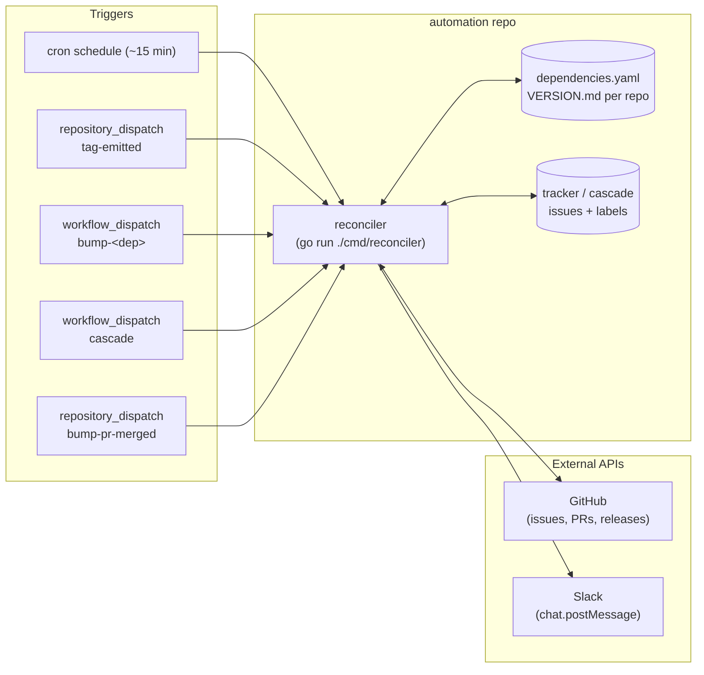
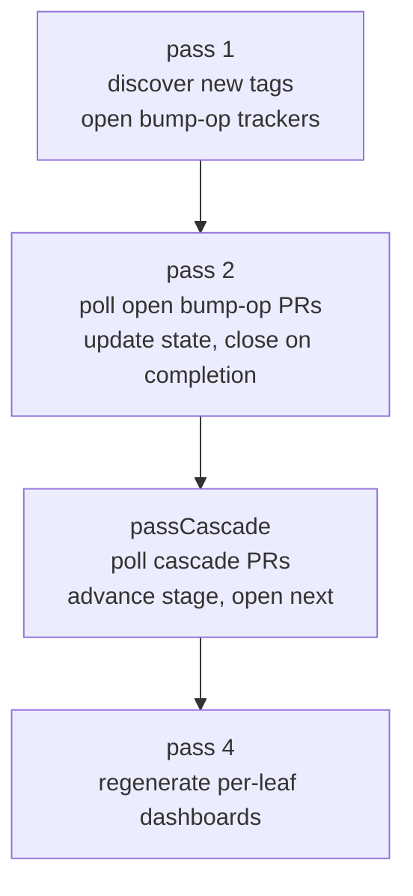
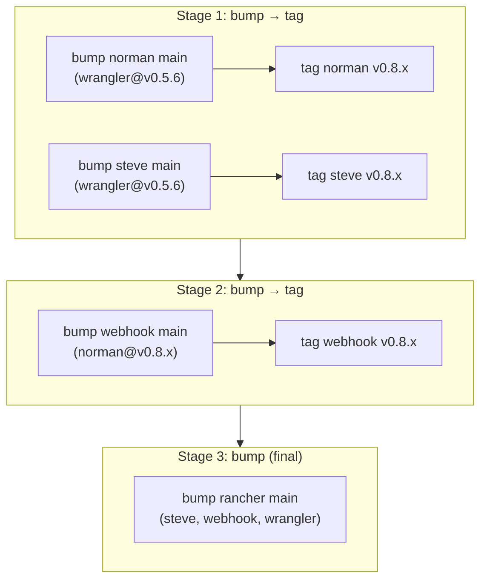
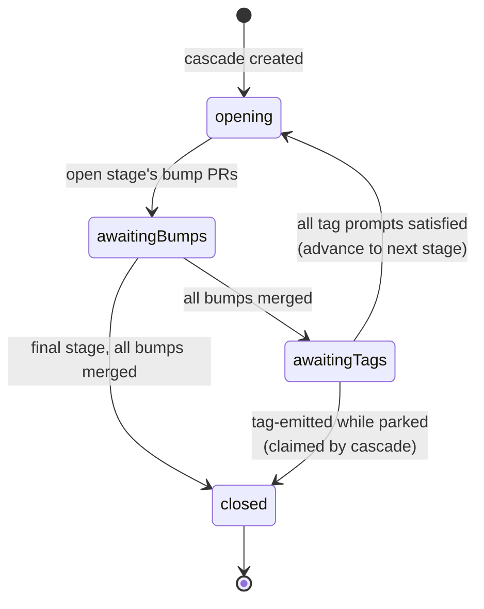

# Architecture

This is the design reference for the release-automation reconciler. For a
short user-facing intro see [`README.md`](README.md); for the day-zero plan
see the project-mode plan file.

## Goal

When a new tag lands in any managed Rancher repo (rancher, steve, apiserver,
norman, webhook, remotedialer-proxy, wrangler, lasso, dynamiclistener,
remotedialer), open dep-bump PRs in every downstream that ships against
that release line, track each PR end-to-end in a GitHub issue, and ping
Slack on transitions. Humans review and merge — the bot only opens.

A second mode walks the dependency DAG one layer at a time toward a chosen
leaf-rancher branch, prompting a re-tag at each intermediate layer so every
layer CIs against the new dep set before the next layer ships. This is the
**cascade** path.

No external database. State for each in-flight operation lives inside the
GitHub issue body as a fenced YAML metadata block. Issues + labels are the
state store; issue history is the audit log.

## High-level shape



The single binary `cmd/reconciler` runs in four modes; the trigger picks
which one. All modes serialize on a workflow-level concurrency lock
(`group: reconciler`) so dispatch and cron runs never race.

## Reconciler modes

| Mode       | Trigger                                       | Purpose                                                                  |
| ---------- | --------------------------------------------- | ------------------------------------------------------------------------ |
| `cron`     | `schedule` (every ~15 min)                    | Discover new releases we didn't dispatch; poll PRs; refresh dashboards.  |
| `dispatch` | `repository_dispatch` `tag-emitted`           | Fast path for a tag we just emitted (~30s end-to-end).                   |
| `bump-dep` | `workflow_dispatch` `bump-<dep>.yaml`         | Manual fan-out of one (dep, version) onto a chosen leaf branch.          |
| `cascade`  | `workflow_dispatch` `cascade.yaml`            | Multi-source DAG walk to a leaf branch; prompts re-tag at each layer.    |

CLI flags select the mode and parameters:

```
go run ./cmd/reconciler -mode=cron
go run ./cmd/reconciler -mode=dispatch -repo=tomleb/foo -tag=v0.7.5 -sha=...
go run ./cmd/reconciler -mode=bump-dep -dep=wrangler -version=v0.5.6 -leaf-branch=release/v2.13
go run ./cmd/reconciler -mode=cascade -leaf-branch=main -independents=wrangler=v0.5.6
```

## Package layout

```
cmd/reconciler/        # entrypoint: parses flags, builds Reconciler, dispatches mode
internal/
  config/              # dependencies.yaml + VERSION.md parsing
  github/              # thin GitHub API client (issues, PRs, releases, files)
  pr/                  # bumper: clone, go get, commit, push, open PR
  tracker/             # bump-op tracker issues (one per (dep, version, leaf-branch))
  cascade/             # cascade tracker issues (one per (leaf-repo, leaf-branch))
  dashboard/           # per-leaf-branch "in-flight" rollup issue
  reconcile/           # the four-pass loop tying everything together
.github/workflows/
  reconciler.yaml           # cron entry
  tag-emitted.yaml          # dispatch entry
  bump-wrangler.yaml        # manual per-dep entry (one per independent)
  cascade.yaml              # manual cascade entry
  bump-pr-merged.yaml       # dispatch entry; fired by downstream repos on automation/* PR merge
  notify-bump-merged.yaml   # reusable workflow called by each downstream repo
dependencies.yaml      # the DAG + per-repo policy
```

The two `internal/*` packages worth understanding first are `tracker` and
`cascade` — they are two separate state machines that share the
"issue body as state store" pattern.

## Configuration

### `dependencies.yaml`

Declares the DAG and per-repo policy. Three kinds:

```yaml
repos:
  rancher:
    kind: leaf                                                # final consumer
    module: github.com/tomleb/frameworks-automation-rancher
    deps: [steve, webhook, wrangler]
  steve:
    kind: paired                                              # follows VERSION.md to a rancher minor
    module: github.com/tomleb/frameworks-automation-steve
    deps: [wrangler]
  wrangler:
    kind: independent                                         # no rancher pairing
    module: github.com/tomleb/frameworks-automation-wrangler
    deps: []
```

- **leaf** — final consumer (rancher). Receives bump PRs; never bumped into anything else.
- **paired** — auto-PR onto the branch whose VERSION.md row matches the upstream's minor.
- **independent** — auto-PR on `main` only. `release/*` branches require the manual `bump-<dep>` workflow.

### `VERSION.md` (in each managed repo)

Per-repo source of truth for branch-to-minor mapping. Read at runtime from
the default branch via the GitHub API. The per-repo Release workflow
validates the input version against this same table.

```
| Branch       | Minor | Matching Rancher |
|--------------|-------|------------------|
| main         | v0.8  | v2.16            |
| release/v0.7 | v0.7  | v2.13            |
```

## State storage: tracker issues

Every in-flight op is one GitHub issue. The body has a human-readable
markdown summary on top and a fenced YAML metadata block at the bottom that
the reconciler reads and rewrites each tick:

```markdown
## Targets
- [ ] rancher main          — PR #1234 (open)
- [ ] rancher release/v2.13 — PR #1235 (ci-failing)

<!-- bump-op-state v1
slack_thread_ts: "1729451234.001900"
targets:
  - {repo: rancher, branch: main,          pr: 1234, state: open}
  - {repo: rancher, branch: release/v2.13, pr: 1235, state: ci-failing}
superseded_by: null
-->
```

`ExtractState` parses the YAML on read, `EmbedState` rewrites it on save.
The body is regenerated every tick (idempotent given the same state +
timestamp), so cosmetic fixes propagate without waiting for a state
transition.

Two state machines, two issue flavors:

| Flavor        | Identity                  | Labels                                              | Lookup                       |
| ------------- | ------------------------- | --------------------------------------------------- | ---------------------------- |
| **bump-op**   | `(dep, version, leaf-branch)` | `bump-op`, `dep:<name>`, `version:<v>`, `leaf:<repo>:<branch>` | by label set                 |
| **cascade**   | `(leaf-repo, leaf-branch)` | `cascade-op`, `leaf:<repo>:<branch>`                | by leaf label; supersede on explicit-source change |

A separate dashboard issue per leaf-branch is regenerated each tick from
both flavors — it has no embedded state.

## Reconciliation passes

The four passes that run during a `cron` sweep:



`dispatch` and `bump-dep` modes run a single pass-1 iteration scoped to one
(dep, version), then run passes 2-4 to keep in-flight ops moving:

```go
case "dispatch":
    r.RunDispatch(ctx, DispatchEvent{Repo, Tag, SHA})  // pass1Dispatch + 2..4
case "bump-dep":
    r.RunBumpDep(ctx, dep, version, leafBranch)       // runBump + 2..4
case "cascade":
    r.RunCascade(ctx, leafBranch, independents)       // creates/finds cascade issue + 2..4
```

### Pass 1 — discover new releases

- **Cron variant** sweeps every upstream's GitHub Releases, synthesizing a
  dispatch for any (dep, version) that doesn't yet have a tracker.
- **Dispatch variant** reacts to one tag-emitted event. Before opening
  trackers it offers the tag to every open cascade via `tryClaimCascadeTag`
  — if a cascade is parked waiting on this dep, the tag fills its
  `TagPrompt` instead of opening a regular bump-op.

Both variants converge on `runBump`, which:

1. Computes targets via `ComputeTargetsForLeafBranch` (which downstreams + branches need this dep version).
2. Finds-or-creates the bump-op tracker; supersedes any older `(dep, prior-version)` tracker on the same leaf-branch.
3. Calls the bumper to open one PR per target.

### Pass 2 — poll PR state

For every open bump-op tracker, fetch each linked PR, derive its state
(`open`, `ci-failing`, `approved`, `merged`, `closed`), compare to the
stored state, post a Slack message in-thread on transition, rewrite the
body. Close the tracker when every target reaches a terminal state.

### Pass cascade — advance the cascade DAG

Symmetric to pass 2 but for cascade trackers: poll the current stage's
bump PRs, fold tagged versions into later stages' deps, dispatch the next
layer's bumps when a stage clears, close the cascade when the final stage
merges. Detail in [Cascade flow](#cascade-flow) below.

### Pass 4 — regenerate dashboards

For every leaf branch, query open bump-op trackers and cascades carrying
the matching `leaf:<repo>:<branch>` label, render a rollup table, overwrite
the dashboard issue body. Read-only; no state persisted in the dashboard.

## The Reconciler

`internal/reconcile.Reconciler` ties everything together:

```go
type Settings struct {
    AutomationRepo string  // owner/name of this repo (for tracker issues)
    GitHubToken    string  // PAT or App token with repo, issues, pull_requests
    SlackToken     string  // optional; empty = silent
    SlackChannel   string  // channel ID, not name
}

type Reconciler struct {
    cfg      *config.Config
    settings Settings
    gh       *ghclient.Client
    bumper   pr.Bumper
}

func (r *Reconciler) RunCron(ctx) error
func (r *Reconciler) RunDispatch(ctx, DispatchEvent) error
func (r *Reconciler) RunBumpDep(ctx, dep, version, leafBranch string) error
func (r *Reconciler) RunCascade(ctx, leafBranch string, independents map[string]string) error
```

`gh` is the only thing that talks to GitHub; `bumper` is the only thing
that runs `go get` and writes to a downstream. Everything else is logic
over those two.

## Bump flow

The dispatch path on a freshly-emitted tag:

```mermaid
sequenceDiagram
    participant rel as Source Repo<br/>(Release workflow)
    participant disp as automation<br/>tag-emitted.yaml
    participant rec as Reconciler<br/>(dispatch mode)
    participant gh as GitHub
    participant ds as Downstream<br/>repo
    participant slack as Slack

    rel->>disp: repository_dispatch<br/>tag-emitted {repo, tag, sha}
    disp->>rec: go run -mode=dispatch
    rec->>gh: list open cascades; offer tag
    note right of rec: tryClaimCascadeTag —<br/>cascade may absorb the tag
    alt no cascade claimed
        rec->>gh: ComputeTargetsForLeafBranch
        rec->>gh: find-or-create bump-op tracker<br/>(label: dep:X version:Y leaf:Z:B)
        rec->>gh: close prior-version tracker (supersede)
        loop per target
            rec->>ds: clone, go get, commit, push
            rec->>gh: create PR
        end
        rec->>slack: post "PRs opened" + persist ts
    end
    rec->>rec: passes 2..4
```

A bump-op tracker is **identity by `(dep, version, leaf-branch)`**. When a
new tag arrives for the same dep, an older tracker for that leaf-branch is
closed with a supersede comment and a link to the new tracker; its open PRs
are closed in turn.

## Cascade flow

A cascade is identity-by-`(leaf-repo, leaf-branch)` with an arbitrary set
of source deps. The user supplies independents (e.g. `wrangler=v0.5.6`);
paired components like steve/webhook/norman are auto-resolved at the
leaf-paired branch's latest tag (`paired-latest`) and pinned at creation.

Re-running with the **same explicit source set** merges into the existing
cascade. A different explicit set supersedes — the prior cascade closes,
its open bump PRs are closed too.

### Stage layout

`ComputeStages` walks `forward(independents) ∩ backward(leaf) ∖ independents`
to get the propagation set, adds the leaf, and assigns layers via
iterative relaxation. Each non-final stage is `bump → tag`; the final
stage is `bump (final)` (no re-tag of the leaf).

Sample DAG: `wrangler → norman → webhook → rancher` and `wrangler → steve → rancher`.
A cascade onto `rancher main` triggered by `wrangler=v0.5.6`:



### Stage state machine



A tag prompt is satisfied either by an emitted tag (claimed via
`tryClaimCascadeTag` from a `tag-emitted` dispatch) or by `maybeClaimExistingTag`
when the bump turned out to be a no-op and a satisfying tag already
existed on the branch.

### State pinning across re-runs

The cascade's metadata block stores both the explicit and paired-latest
sources. `mergeState` overlays stored Versions onto recomputed Sources, so
once a paired-latest is pinned at creation it doesn't drift even if a
newer tag drops mid-cascade. Same applies to stage bumps' per-Dep
versions.

A subtle correctness point worth noting: when the cascade advances from
stage N to stage N+1, it folds in the recorded tags from **every prior
stage**, not just N. A layer-1 repo (like steve) that gets tagged in stage
1 is still a direct dep of the leaf at stage 3, so the leaf's bump
bundle has to see steve's stage-1 tag.

## Bumper

`internal/pr/bumper.go` is the only place that runs `go get`:

```go
type Request struct {
    Repo       string   // owner/name
    BaseBranch string   // e.g. release/v2.13
    HeadBranch string   // e.g. automation/cascade-42-bump-rancher-main
    Modules    []Module // one or more (path, version) pairs bundled in one PR
    TrackerURL string   // included in the PR body as "Tracker: <url>"
}

type Result struct {
    PR    *PR    // newly opened or reused
    NoOp  bool   // go.mod already at every target version — nothing to commit
    Reuse bool   // a PR already existed on this head branch
    Notes string // human log line
}
```

Flow: shallow clone at `BaseBranch` into a temp dir, `go get` each module,
`go mod tidy`, optional `go mod vendor` if `vendor/` exists, commit, push
the head branch, open the PR via the GitHub client. Bundled modules go
into one PR — cascade stages bundle everything a downstream needs at that
layer so cascade-mid tags CI against the combined post-bump tree.

Branch naming is deterministic so re-runs idempotently dedupe via
`ListOpenPRsByHead`:

- bump-op: `automation/bump-<dep>-<version>-<branch>`
- cascade: `automation/cascade-<issue-number>-bump-<repo>-<branch>`

The cascade name embeds the issue number so a supersede creates fresh
branches that can't collide with the closed PRs of the cascade it replaced.

## GitHub client

`internal/github/client.go` is a thin wrapper over `go-github` exposing
just what the reconciler needs:

```go
FetchFile(ctx, repo, ref, path) (string, error)
GetLatestReleaseTag(ctx, repo) (string, error)
ListReleaseTags(ctx, repo) ([]string, error)
ListOpenIssues(ctx, repo, labels []string) ([]*Issue, error)
ListIssuesAllStates(ctx, repo, labels []string) ([]*Issue, error)
CreateIssue / UpdateIssueBody / CloseIssue
GetPR / ListOpenPRsByHead / CreatePR / ClosePR
```

`ListReleaseTags` queries **published GitHub Releases**, not git tags
(important: a bare `git tag && git push` won't satisfy "is this a release?").

## Concurrency

All four workflow files share `concurrency: { group: reconciler,
cancel-in-progress: false }` so any combination of cron, dispatch, bump-dep,
and cascade runs serializes. No tracker-issue race; no double-posts to
Slack.

## Extension points

- **New independent**: add a `kind: independent` row to `dependencies.yaml`,
  add a matching `bump-<dep>.yaml` workflow, add a matching input block in
  `cascade.yaml`. The reconciler discovers the rest via VERSION.md.
- **New paired component**: add the row, no workflow plumbing — pass 1
  picks it up on the next cron tick and the cascade picks it up as
  paired-latest.
- **New leaf**: extend `cfg.LeafRepos()`. The dashboard loop is already
  written for N leaves; pass 1 cron currently assumes a single rancher
  leaf and will need a tweak.

## Out of scope today

- Re-tagging via the per-repo Release workflow stays manual at every
  cascade-mid layer (devs click `Run workflow` with the next-patch version
  pre-filled by the cascade prompt).
- PR-state polling ceiling is ~15 min on cron for external repos. For
  `automation/*` bump PRs, each downstream repo fires a `bump-pr-merged`
  dispatch on merge, cutting pass-2 latency to ~30s. This uses a workflow-level
  hook in each downstream repo (not a GitHub webhook — no webhook configuration
  required).
- Branch-cut workflow (creating new `release/vX.Y` branches and applying
  tag protection) is deferred.
